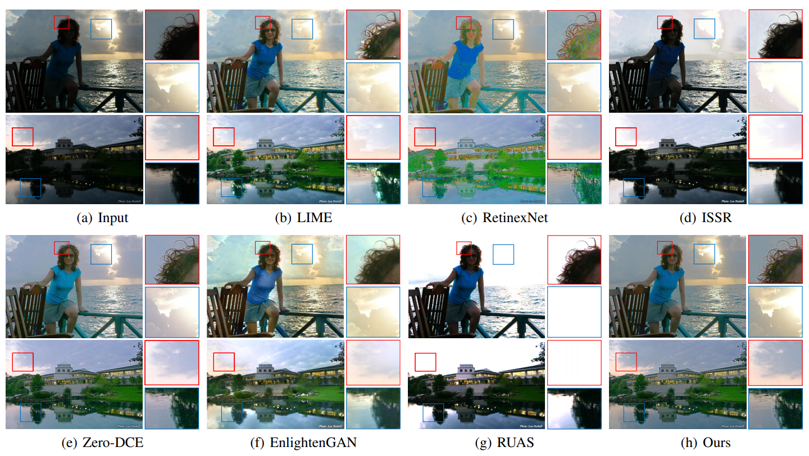

# Semantically Contrastive Learning for Low-light Image Enhancement

Low-light image enhancement (LLE) remains challenging due to the unfavorable prevailing low-contrast and weak-visibility problems of single RGB images. In this paper, we respond to the intriguing learning-related question -- if leveraging both accessible unpaired over/underexposed images and high-level semantic guidance, can improve the performance of cutting-edge LLE models? Here, we propose an effective semantically contrastive learning paradigm for LLE (namely SCL-LLE). Beyond the existing LLE wisdom, it casts the image enhancement task as multi-task joint learning, where LLE is converted into three constraints of contrastive learning, semantic brightness consistency, and feature preservation for simultaneously ensuring the exposure, texture, and color consistency. SCL-LLE allows the LLE model to learn from *unpaired* positives (normal-light)/negatives (over/underexposed), and enables it to interact with the scene semantics to regularize the image enhancement network, yet the interaction of high-level semantic knowledge and the low-level signal prior is seldom investigated in previous methods. Training on readily available open data, extensive experiments demonstrate that our method surpasses the state-of-the-arts LLE models over six independent cross-scenes datasets. Moreover, SCL-LLE's potential to benefit the downstream semantic segmentation under extremely dark conditions is discussed.

****

## Results
- Comparison of SCL-LLE and the state-of-the-art methods over VV and DICM datasets with zoom-in regions.
  

## Experiment

PyTorch implementation of SCL-LLE

### Requirements

- Python 3.7 
- PyTorch 1.4.0
- opencv
- torchvision 
- numpy 
- pillow 
- scikit-learn 
- tqdm 
- matplotlib 
- visdom 

SCL-LLE does not need special configurations. Just basic environment.

### Folder structure

The following shows the basic folder structure.
```python
├── datasets
│   ├── data
│   │   ├── cityscapes
│   │   └── Contrast
|   ├── test_data
│   ├── cityscapes.py
|   └── util.py
├── network # semantic segmentation model
├── lowlight_test.py # low-light image enhancement testing code
├── train.py # training code
├── lowlight_model.py
├── Myloss.py
├── checkpoints
│   ├── best_deeplabv3plus_mobilenet_cityscapes_os16.pth #  A pre-trained semantic segmentation model
│   ├── LLE_model.pth #  A pre-trained SCL-LLE model
```

### Test

- cd SCL-LLE_code


```
python lowlight_test.py
```

The script will process the images in the sub-folders of "test_data" folder and make a new folder "result" in the "datasets". You can find the enhanced images in the "result" folder.

### Train

1. cd SCL-LLE_code
2. download the [Cityscapes](https://www.cityscapes-dataset.com/) dataset
3. download the training data <a href="https://drive.google.com/file/d/1FzYwO-VRw42vTPFNMvR28SnVWpIVhtmU/view?usp=sharing">google drive</a>
4. unzip and put the downloaded "train" folder to "datasets/data/cityscapes/leftImg8bit" folder
5. 


```
python train.py
```
