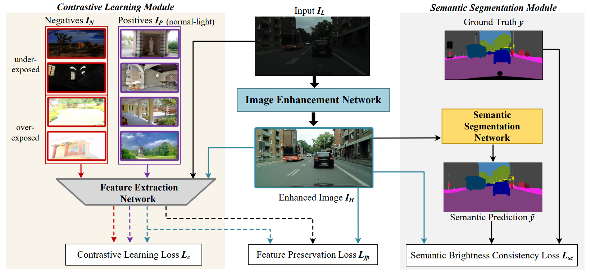

# Semantically Contrastive Learning for Low-light Image Enhancement

Here, we propose an effective semantically contrastive learning paradigm for Low-light image enhancement (namely SCL-LLE). Beyond the existing LLE wisdom, it casts the image enhancement task as multi-task joint learning, where LLE is converted into three constraints of contrastive learning, semantic brightness consistency, and feature preservation for simultaneously ensuring the exposure, texture, and color consistency. SCL-LLE allows the LLE model to learn from *unpaired* positives (normal-light)/negatives (over/underexposed), and enables it to interact with the scene semantics to regularize the image enhancement network, yet the interaction of high-level semantic knowledge and the low-level signal prior is seldom investigated in previous methods. 

****

## Network

  
  - Overall architecture of our proposed SCL-LLE. It includes a low-light image enhancement network, a contrastive learning module and a semantic segmentation module.

## Experiment

PyTorch implementation of SCL-LLE

### Requirements

- Python 3.7 
- PyTorch 1.4.0
- opencv
- torchvision 
- numpy 
- pillow 
- scikit-learn 
- tqdm 
- matplotlib 
- visdom 

SCL-LLE does not need special configurations. Just basic environment.

### Folder structure

The following shows the basic folder structure.
```python
├── datasets
│   ├── data
│   │   ├── cityscapes
│   │   └── Contrast
|   ├── test_data
│   ├── cityscapes.py
|   └── util.py
├── network # semantic segmentation model
├── lowlight_test.py # low-light image enhancement testing code
├── train.py # training code
├── lowlight_model.py
├── Myloss.py
├── checkpoints
│   ├── best_deeplabv3plus_mobilenet_cityscapes_os16.pth #  A pre-trained semantic segmentation model
│   ├── LLE_model.pth #  A pre-trained SCL-LLE model
```

### Test

- cd SCL-LLE


```
python lowlight_test.py
```

The script will process the images in the sub-folders of "test_data" folder and make a new folder "result" in the "datasets". You can find the enhanced images in the "result" folder.

### Train

1. cd SCL-LLE
2. download the [Cityscapes](https://www.cityscapes-dataset.com/) dataset
3. download the cityscapes training data <a href="https://drive.google.com/file/d/1FzYwO-VRw42vTPFNMvR28SnVWpIVhtmU/view?usp=sharing">google drive</a> and contrast training data <a href="https://drive.google.com/file/d/1A2VWyQ9xRXClnggz1vI-7WVD8QEdKJQX/view?usp=sharing">google drive</a> 
4. unzip and put the downloaded "train" folder and "Contrast" folder to "datasets/data/cityscapes/leftImg8bit" folder and "datasets/data" folder
5. download the [pre-trained semantic segmentation model](https://drive.google.com/file/d/18VXnVlLn2LFSpXPiZSh8Wva8jhsUBlXx/view?usp=sharing) and put it to "checkpoints" folder


```
python train.py
```
## Cite
If you find our work useful in your research please consider citing our paper:
```
@inproceedings{liang2022semantically,
  title={Semantically contrastive learning for low-light image enhancement},
  author={Liang, Dong and Li, Ling and Wei, Mingqiang and Yang, Shuo and Zhang, Liyan and Yang, Wenhan and Du, Yun and Zhou, Huiyu},
  booktitle={Proceedings of the AAAI Conference on Artificial Intelligence},
  volume={36},
  number={2},
  pages={1555--1563},
  year={2022}
}
```

## Contact
If you have any question, please contact liling@nuaa.edu.cn
